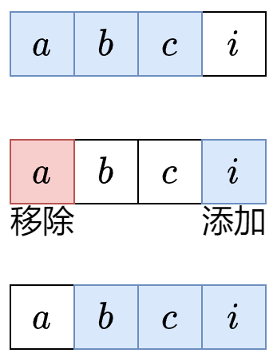

## 定长滑动窗口
例子：计算字符串中长度为k的子串中，最多可以包含多少元音字母。

暴力枚举所有子串？时间复杂度是 O(nk)，太慢了。能否 O(n) 计算子串的元音个数？

对于下图的字符串 abci，假如我们已经计算出了子串 abc 的元音个数，那么从子串 abc 到子串 bci，只需要考虑移除（离开窗口）的字母 a 是不是元音，以及添加（进入窗口）的字母 i 是不是元音即可，因为中间的字母 b 和 c 都在这两个子串中。

### 举例
示例 1，s=abciiidef, k=3。

1. 从左到右遍历 s。
2. 首先统计前 k−1=2 个字母的元音个数，这有 1 个。
3. s[2]=c 进入窗口，此时找到了第一个长为 k 的子串 abc，现在元音个数有 1 个，更新答案最大值。然后 s[0]=a 离开窗口，现在元音个数有 0 个。
4. s[3]=i 进入窗口，此时找到了第二个长为 k 的子串 bci，现在元音个数有 1 个，更新答案最大值。然后 s[1]=b 离开窗口，现在元音个数有 1 个。
5. s[4]=i 进入窗口，此时找到了第三个长为 k 的子串 cii，现在元音个数有 2 个，更新答案最大值。然后 s[2]=c 离开窗口，现在元音个数有 2 个。
6. s[5]=i 进入窗口，此时找到了第四个长为 k 的子串 iii，现在元音个数有 3 个，更新答案最大值。然后 s[3]=i 离开窗口，现在元音个数有 2 个。
7. s[6]=d 进入窗口，此时找到了第五个长为 k 的子串 iid，现在元音个数有 2 个，更新答案最大值。然后 s[4]=i 离开窗口，现在元音个数有 1 个。
8. s[7]=e 进入窗口，此时找到了第六个长为 k 的子串 ide，现在元音个数有 2 个，更新答案最大值。然后 s[5]=i 离开窗口，现在元音个数有 1 个。
9. s[8]=f 进入窗口，此时找到了第七个长为 k 的子串 def，现在元音个数有 1 个，更新答案最大值。遍历结束。

### 定长滑窗套路，所有定滑窗口
`入-更新-出`

1. 入：下标为 i 的元素进入窗口，更新相关统计量。如果 `i<k−1` 则重复第一步。
2. 更新：更新答案。一般是更新最大值/最小值。
3. 出：下标为 `i−k+1` 的元素离开窗口，更新相关统计量。

